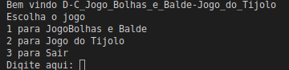
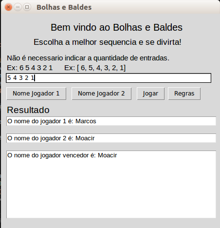
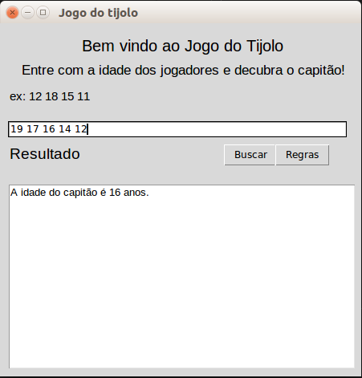

Temas:
 - D&C
 
# Jogo_Bolhas_e_Balde-Jogo_do_Tijolo

**Conteúdo da Disciplina**: D&C 

## Alunos
|Matrícula | Aluno |
| -- | -- |
| 17/0080366  |  Moacir Mascarenha |
| 15/0062567  |  Marcos Adriano Nery |

## Sobre 

### Problema

O projeto consiste em utilizar os conceitos dos algoritmos, de dividir e conquistar, apresentados na matéria(projeto de algoritmos) para solucionar problemas do [URI](www.urionlinejudge.com.br).

- [Bolhas e Baldes](https://www.urionlinejudge.com.br/judge/pt/problems/view/1088) (Mergesort):
    
    A partir de um vetor de inteiros gerado(sequência inicial), cada jogador faz um movimento, e a jogada passa para o outro jogador. Um movimento de um jogador consiste na escolha de um par de elementos consecutivos da seqüência que estejam fora de ordem e em inverter a ordem dos dois elementos. Mais cedo ou mais tarde, a seqüência ficará ordenada. Perde o jogador impossibilitado de fazer um movimento.
    O objetivo do algoritmo é encontrar o vencedor, dada a sequência inicial.

- [Jogo do Tijolo](https://www.urionlinejudge.com.br/judge/pt/problems/view/1436) (Mediana das Medianas):

    Jogo de tijolo é um jogo de equipe. Cada equipe é constituída por um número ímpar de jogadores. O número de jogadores deve ser maior do que 1.
    
    A falta de comunicação entre dois jogadores depende da sua diferença de  idade, ou seja, é maior se a diferença de idade for maior. Assim, eles 
    selecionam o capitão de uma equipe de maneira que a quantidade de jogadores desta equipe que são mais jovens e mais velhos do que ele é igual.

    O objetivo do algoritmo é encontrar o capitão do time a partir das idades dos jogadores, utilizando a mediana.

## Screenshots

### Menu

### Jogo Bolhas e Balde

### Jogo do Tijolo

## Instalação 
**Linguagem**: Python 

#### Requisitos

- python3 instalado
- Biblioteca tkinter instalada
    
        pip install tkinter

## Uso 

[Instruções em video](https://www.dropbox.com/s/z64pbr47voewggu/projalgoritmos%20on%202020-11-14%2001-56.mp4?dl=0)

### Rodar a Aplicação

    1° Entre na pasta src
    2° Execute: python3 main.py
        3° Escolha o jogo(1-Bolhas e Baldes ou 2-Jogo do Tijolo)
            Bolhas e Baldes:
                1° Aguarde a janela carregar
                2° Adicione o nome do jogador 1
                3° Precione o botão "Nome Jogador 1"
                4° Adicione o nome do jogador 2
                5° Precione o botão "Nome Jogador 2"
                5° Adicione a sequencia de inteiros
                5° precione  o botão "Jogar"
            Jogo do Tijolo:
                1° Aguarde a janela carregar
                2° Adicione o numero dos jogadores
                3° Precione o botão "Buscar"
                
                

## Referências

> Median-finding Algorithm. Disponível em: https://brilliant.org/wiki/median-finding-algorithm/

> Bolhas e Baldes. Disponível em: https://www.urionlinejudge.com.br/judge/pt/problems/view/1088

> Jogo do Tijolo. Disponível em: https://www.urionlinejudge.com.br/judge/pt/problems/view/1436

